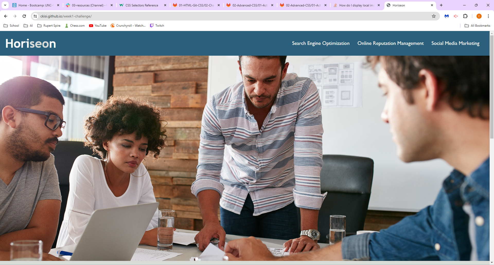
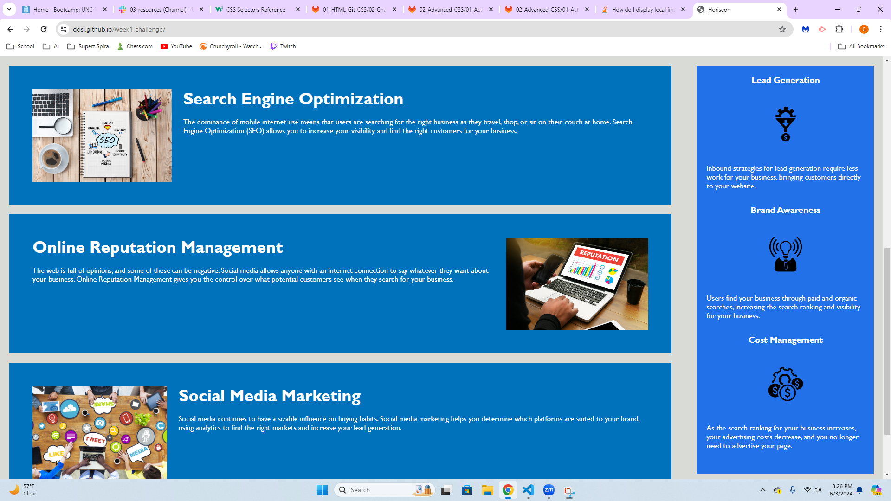
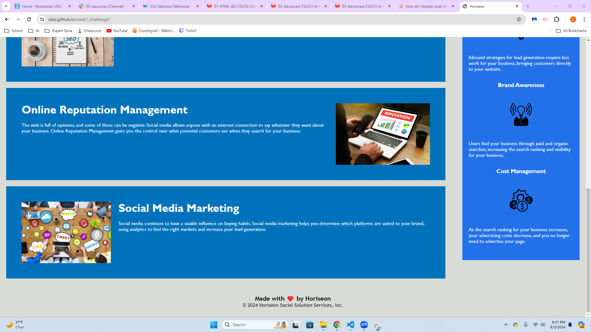

# Horiseon Project

## Description
This was a project where I modified a website to make it more accessible. Using the WAVE extension, I identified errors and fixed them. I changed many things like color contrast and added alt text to images. There was also a broken link so I fixed it. I changed all the HTML elements to semantic HTML elements. The header sizes were also changed to sequential order.

## Tools Used
VS Code
WAVE Extension

## Links
https://ckisi.github.io/week1-challenge/

